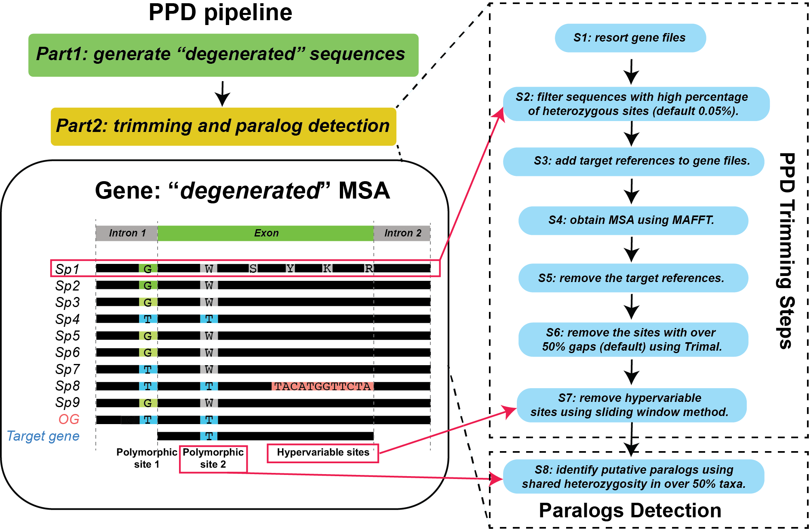

# Putative Paralogs Detection (PPD) for Enrichment Data

This method is based on shared heterozygous information to detect putative paralogs for Hyb-Seq data. Highly recommended for Hyb-Seq downstream analysis after [HybPiper](https://github.com/mossmatters/HybPiper).

## Prerequisites:
Run the main [HybPiper](https://github.com/mossmatters/HybPiper) script and check the results in [individual]/[gene]/[individual]/sequences/intron/ and [individual]/[gene]/[individual]/sequences/FNA/ directories.

All the intron and exon sequences are considered as input for Step1.

## Software/dependencies

1. [Picard](http://broadinstitute.github.io/picard/) for Step2.
```
check if picard is installed successfully by typing "picard -h" in terminal.
```

2. [GATK](https://software.broadinstitute.org/gatk/download/) for Step2.

```
check if GATK is installed successfully by typing "gatk -h" in terminal.
```

3. [python](https://www.python.org/downloads/) and its dependencies for Step3.
* [Biopython](https://biopython.org/wiki/Packages). Easy installation from [conda](https://biopython.org/wiki/Packages) 
* [numpy](https://numpy.org/doc/stable/user/whatisnumpy.html). Easy installation from [conda](https://anaconda.org/anaconda/numpy)

4. [MAFFT](https://mafft.cbrc.jp/alignment/software/) for Step3. Easy installation from [conda](https://anaconda.org/bioconda/mafft)

```
check if MAFFT is installed successfully by typing "mafft -h" in terminal.
```

5. [trimAl](http://trimal.cgenomics.org/) for Step3. Easy installation from [conda](https://anaconda.org/bioconda/trimal)

```
check if trimAl is installed successfully by typing "trimal -h" in terminal.
```

## Environment
Examples can be run on Mac or Linux.

## Steps
It includes two parts as follows:



### Part1
Step1: Concatenate all the supercontigs into a single file. All supercontigs are stored in two new files named supercontig and exon.
  This script is modified from [Mossmatters github "Alleles from HybSeq Data"](https://github.com/mossmatters/phyloscripts/tree/master/alleles_workflow).
  
  ```
  Please type in the following arguments after Step1.sh in order: 
  * The direcotory HybPiper.
  * full name of namelist.
  
  Example: ./Step1.sh ./HybPiper-master/[Hybpiper_result_file]/ [full_path]/namelist.txt
  ```
  
Step2: Generate the degenerated seuqences using IPUAC codes.
This script is modified from [Mossmatters github "Alleles from HybSeq Data"](https://github.com/mossmatters/phyloscripts/tree/master/alleles_workflow).

```
  "Please type in the following arguments after Step2.sh in order: 
  1. BWA -k matching base length (if raw reads are 150 bp, we recommand use 100 bp here). 
  2. ploidy number of a species (2, 3, 4 ...)
  3. a direcotory containing consensus sequences from Step1.
  4. a directory containing all raw reads file after QC control (keep raw reads in fastq.gz format).
  5. output directory (to keep the degerated sequences file, which will be used for Step3).
  6. full name of namelist.
  
  Example: ./Step2.sh 100 2 [Step1_output_path] [QC_raw_reads_path] [output_directory] [full_path]/namelist.txt
```
##### Note
```
Please check Step2 result contains all sequences from all individuals. If not, you can generate a new subset namelist file and run the Step2 again.
```

### Part2
It includes 8 steps for trimming and paralog detection (see Figure above). Conduct the downstream analysis for matrices with heterozyous sites information.


#### EXAMPLE
  The command for examples.
  ```python
  python ../PPD.py -ifa degenerated_sequences_from_step2 -ina namelist_C.txt -iref Angiosperms353_targetSequences.fasta -io outgroup.txt -o ./ -t supercontig -he 0.05 -gt 0.51 -hs 0.5 -nh 1 -w 20 -mi 5 -mo 8
  ```
  
  This script is used to find putative paralogs in 353 enrichment data. It requires four input components and one output component. The "-ifa", "-ina", "-iref", "-io", "-o" are required arguments.
  
  To check all parameters in PPD.py using:
  ```python
  python PPD.py -h
  ```
  
##### Parameter Setting Details
```python
usage: PPD.py [-h] [-ifa INPUT_DIR] [-ina INPUT_SP_NAME]
                  [-iref INPUT_REF_SEQ] [-io INPUT_OUTGROUP] [-o OUTPUT_DIR]
                  [-t SEQ_TYPE] [-he HSITE_VALUE] [-gt GAP_THRESHOLD] [-hs HS_MAX_VALUE]
                  [-nh HS_SITE_NUMBER] [-w WINDOW_SIZE] [-mi MAX_P_SITE] [-mo MAX_P_SITE_O]

optional arguments:
  -h, --help            show this help message and exit
  -ifa INPUT_DIR, --inputfastadir INPUT_DIR
                        The directory where degenerated fasta files deposits, which are generated by Step2
  -ina INPUT_SP_NAME, --inputspna INPUT_SP_NAME
                        The full path of namelist.txt with every accession in each line
  -iref INPUT_REF_SEQ, --inputref INPUT_REF_SEQ
                        The full path of reference seq, which is as same as the one in Hybpiper. It requires Fasta format. The reference names should be formated as "SPECIESNAME-GENENAME". Please Capitalize them. See example.
  -io INPUT_OUTGROUP, --inputoutgroup INPUT_OUTGROUP
                        The full path of outgroups.txt. Every line has only one accession. See example.
  -o OUTPUT_DIR, --output OUTPUT_DIR
                        Output path. You can run supercontig and exon using the same path, it will generate a "Result" folder under the path for you.
  -t SEQ_TYPE, --seqtype SEQ_TYPE
                        It can be either "supercontig" or "exon" data type. Default is "supercontig".
  -he HSITE_VALUE, --Hsites HSITE_VALUE
                        Maximum percentage of heterozygous site in a sequence. The default value is 0.05 (means 5%).
  -gt GAP_THRESHOLD, --gapthreshold GAP_THRESHOLD
                        1 - (fraction of sequences with a gap allowed). See details in trimmAl -gt. The default value is 0.51. This means that "Removes all sites in the alignment with gaps in 49% or more of the sequences."
  -hs HS_MAX_VALUE, --Hs HS_MAX_VALUE
                        Maximum shared heterozygous percentage at a site. The default value is 0.5 (means 50%).
  -nh HS_SITE_NUMBER, --numberH HS_SITE_NUMBER
                        The number of sites with maximum shared heterozygous percentage. The default value is 1. This means if one or more sites with overwhelming shared heterozygous percentage were detected in a locus, this locus will be considered as paralogs.
  -w WINDOW_SIZE, --windowsize WINDOW_SIZE
                        setting the sliding window size. The default is 20 bp.
  -mi MAX_P_SITE, --maxpsite MAX_P_SITE
                        The number of polymorphism site in each sliding window without outgroup. Default is 4. In the ingroup species, if 5 or more polymorphism sites out of 20 bp window are detected, the whole ploymorphic sites will be removed. This can be customized by the observation of your alignment data.
  -mo MAX_P_SITE_O, --maxpsiteo MAX_P_SITE_O
                        The number of polymorphism site of outgroup in each sliding window. Default is 8. In the outgroup species, if 9 or more polymorphism sites out of 20 bp window are detected, only ploymorphic sites in outgroup will be replaced by "-". This can be customized by the observation of your alignment data.

```

## Output
The second part of PPD will generate eight output folders for each step. Folder 1 contians all individual sequences from the same gene (maximum is 353 genes for Angiosperm 353). Folder 2 has the matrices with removed the individual sequences having high Heterozygous and an output recording the heterozygousity percentage for each individual gene sequence. Folder 3 has matrices with references sequences included. Folder 4 includes the alignments using MAFFT. Folder 5 contains the alignments without references. Folder 6 contains the alignments with gappy region trimmed. Folder 7 contains the alignments with hypervariable regions trimmed by sliding window method. Folder 8 contains the categorized orthologs and paralogs data and a record for the shared hterozygous site percentage among each gene.

## Citation

* Zhou, W., Soghigian, J., Xiang, Q. 2021, A New Pipeline for Removing Paralogs in Target Enrichment Data. Systematic Biology, syab044. DOI: /10.1093/sysbio/syab044.

* Kates, H.R., Johnson, M.G., Gardner, E.M., Zerega, N.J. and Wickett, N.J., 2018. Allele phasing has minimal impact on phylogenetic reconstruction from targeted nuclear gene sequences in a case study of Artocarpus. American journal of botany, 105(3), pp.404-416.
